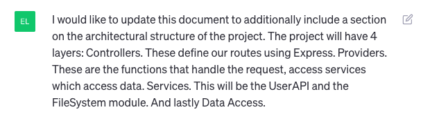
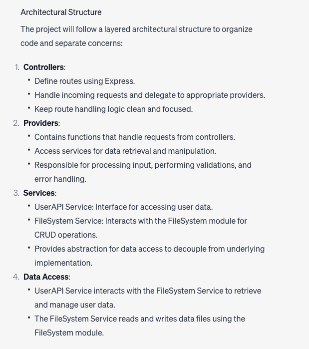
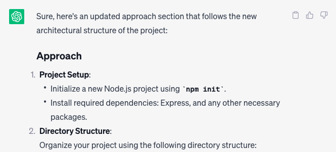
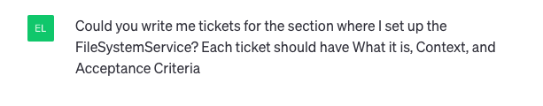
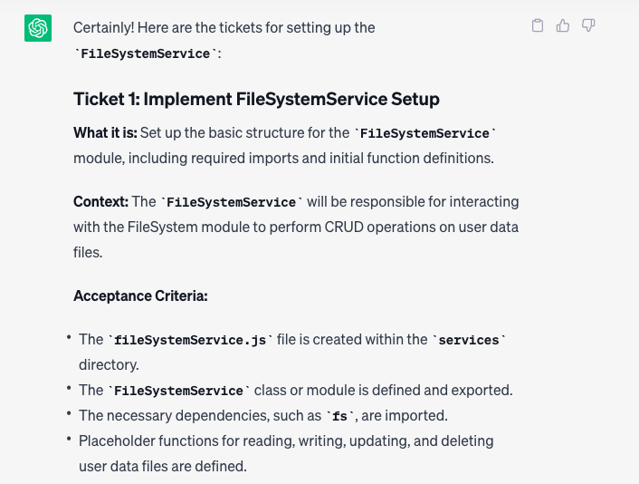

# AI UserAPI

#### Emma Gerigscott and Sarah Reimann

## What this is

This project will wrap the UserAPI in an Express application so it is queryable through endpoints and the data is persistent. This will be built with the assistance of several AI tools.

## Context

The purpose of this project is to document the junior developers approach to using AI tools with the intent of assisting future onboarding, interns, and developer training. We will use AI to write our technical design and tickets according to the approach listed therein. Tickets will include an overview of the approach to be applied to the problem set and the AI tools to be used.

## Table of Contents
1. [Utliizing ChatGPT to create Technical Design Document](#utilizing-chatgpt-to-create-technical-design-document)
  * [Overview](#overview)
  * [Media](#media)
  * [Resources](#resources)
  * [Notes](#notes)
2. [Utilizing ChatGPT to create tickets](#utilizing-chatgpt-to-create-tickets)
  * [Overview](#overview-1)
  * [Resources](#resources-1)
  * [Notes](#notes-1)
3. [Regenerating new tickets for FileSystem](#regenerating-new-tickets-for-filesystem)
  * [Overview](#overview-2)
  * [Media](#media-1)
  

## Utilizing ChatGPT to create Technical Design Document

Ticket #80: [Ai UserAPI Tech Design](https://github.com/olioapps/typescript-starter-lab/issues/80)

### Overview

1. Starting with a concise but broad query: "Write a technical design document for an Express RESTful API that stores users with name, age, favColor, and a unique ID. Please include the following sections: Goal, Known Resources, High Level Design, Shapes, Questions, Test Cases, and Approach."
2. Based on the answer, we will refine the sections and include tech spikes where necessary as well as any additional resources.
3. We also want to test out CoPilot's ability to suggest markdown formatting and Tech Design doc suggestions

### Resources
[ChatGPT conversation to generate Tech Design Document](https://chat.openai.com/share/49f6d11b-8b83-4944-976d-1b740b481552)
[ChatGPT architecture generation](https://chat.openai.com/share/12249f85-ce16-455c-9619-4c8f6b561a6c)

### Media
**Query to update architecture**

**Query to update approach based on new architecture**

### Notes
- In the initial query we forgot to clarify that we wanted to use FileSystem, and ChatGPT used MongoDB instead.
- The next query we wanted to write the same document but include FileSystem.
- We want to include tech spikes, so we are asking ChatGPT to include a tech spike in our resources section for using FileSystem to create and store persistent data.
- Since we are unfamiliar with FileSystem and how that creates persistent data in a browser we are asking ChatGPT to be more specific and link resources in the tech spike.
- We also want a tech spike on Express.js for RESTful API Developement which we've asked ChatGPT to include. Since we asked for more specifics for the FileSystem tech spike, ChatGPT followed the previous format and included links to resources.
- We are also using CoPilot to assist in formatting the markdown document as well as editing based on CoPilot suggestions.
- Updated the tech design to include a section on architecture based on conversation with human Dustin, using ChatGPT to define architecture and CoPilot to format the markdown.

## Utilizing ChatGPT to create tickets

### Overview
We are going to use ChatGPT to create tickets for the steps listed in the approach section of the tech design document. We will ask ChatGPT to create a ticket for each step and then refine the ticket to include more information.

### Resources
[ChatGPT conversation to generate Tech Design Document](https://chat.openai.com/share/49f6d11b-8b83-4944-976d-1b740b481552)

### Notes
- Query: Write tickets for the listed steps under the Approach section of the tech design document. Give information on what the ticket should include and how it should be formatted.
  - Response: Created tickets for each section in the approach section, content is a bit vague but a good place to start
- Query: For tickets using middle ware, could you be more specific on what technology should be used in the acceptance criteria and add specificity for using FileSystem
  - Response: added more information about what the middleware function should do
- Query: ask it to create a ticket for setting up the FileSystem module
  - It did not create the requested ticket
- Asked more directly to create a ticket for FileSystem and that worked
- Updated architecture section to include more information about the layers of the application, queried to have new tickets reflect the FileSystem services section.

Overall, the tickets created were a good starting point but needed more information and specificity. 

## Regenerating new tickets for FileSystem

### Overview
Our understanding of the problem set has changed based on feedback from Dustin. We are going to regenerate the tickets for FileSystem to reflect the new understanding of the layers of the application.

### Media

### Media
**Query to create subtickets for FileSystem**

