# AI UserAPI

#### Emma Gerigscott and Sarah Reimann

## What this is

This project will wrap the UserAPI in an Express application so it is queryable through endpoints and the data is persistent. This will be built with the assistance of several AI tools.

## Context

The purpose of this project is to document the junior developers approach to using AI tools with the intent of assisting future onboarding, interns, and developer training. We will use AI to write our technical design and tickets according to the approach listed therein. Tickets will include an overview of the approach to be applied to the problem set and the AI tools to be used.

## Table of Contents

1. [Utilizing ChatGPT to create Technical Design Document](#utilizing-chatgpt-to-create-technical-design-document)
2. [Utilizing ChatGPT to create tickets](#utilizing-chatgpt-to-create-tickets)
3. [Regenerating new tickets for FileSystem](#regenerating-new-tickets-for-filesystem)
4. [Implementing FileSystemService Strategy](#implementing-filesystemservice-strategy)
5. [Ticket #105: Test Express Routes](#ticket-105-test-express-routes)
6. [Integrating FileSystemService with UserAPIService](#integrating-filesystemservice-with-userapiservice)
7. [Create UserProvider](#create-userprovider)
8. [#112 Connect Express to UserProvider](#112-connect-express-to-userprovider)
9. [Understanding FileSystemService](#understanding-filesystemservice)
10. [Overall Thoughts on Using AI](#overall-thoughts-on-using-ai)

## Utilizing ChatGPT to create Technical Design Document

Ticket #80: [Ai UserAPI Tech Design](https://github.com/olioapps/typescript-starter-lab/issues/80)

### Overview

1. Starting with a concise but broad query: "Write a technical design document for an Express RESTful API that stores users with name, age, favColor, and a unique ID. Please include the following sections: Goal, Known Resources, High Level Design, Shapes, Questions, Test Cases, and Approach."
2. Based on the answer, we will refine the sections and include tech spikes where necessary as well as any additional resources.
3. We also want to test out CoPilot's ability to suggest markdown formatting and Tech Design doc suggestions

### Resources

[ChatGPT conversation to generate Tech Design Document](https://chat.openai.com/share/49f6d11b-8b83-4944-976d-1b740b481552)
[ChatGPT architecture generation](https://chat.openai.com/share/12249f85-ce16-455c-9619-4c8f6b561a6c)

### Media

**Query to update architecture**

**Query to update approach based on new architecture**

### Notes

- In the initial query we forgot to clarify that we wanted to use FileSystem, and ChatGPT used MongoDB instead.
- The next query we wanted to write the same document but include FileSystem.
- We want to include tech spikes, so we are asking ChatGPT to include a tech spike in our resources section for using FileSystem to create and store persistent data.
- Since we are unfamiliar with FileSystem and how that creates persistent data in a browser we are asking ChatGPT to be more specific and link resources in the tech spike.
- We also want a tech spike on Express.js for RESTful API Developement which we've asked ChatGPT to include. Since we asked for more specifics for the FileSystem tech spike, ChatGPT followed the previous format and included links to resources.
- We are also using CoPilot to assist in formatting the markdown document as well as editing based on CoPilot suggestions.

- We both used ChatGPT and then CoPilot to write the tech design document and tech spikes. After we made our own versions we peer reviewed each others work and merged our work into the feature branch `ai-userAPI-techdesign`

## Writing Tickets with ChatGPT + CoPilot

### Overview

1. Write initial tickets based on tech design document using ChatGPT
2. Write out tickets in markdown format using CoPilot
3. Review CoPilot suggestions to refine tickets

### Resources

### Notes

- With our tech design document finalized, we'll write out the tickets using ChatGPT for initial information and CoPilot to format the markdown.

- Updated the tech design to include a section on architecture based on conversation with human Dustin, using ChatGPT to define architecture and CoPilot to format the markdown.

## Utilizing ChatGPT to create tickets

### Overview

We are going to use ChatGPT to create tickets for the steps listed in the approach section of the tech design document. We will ask ChatGPT to create a ticket for each step and then refine the ticket to include more information.

### Resources

[ChatGPT conversation to generate Tech Design Document](https://chat.openai.com/share/49f6d11b-8b83-4944-976d-1b740b481552)

### Notes

- Query: Write tickets for the listed steps under the Approach section of the tech design document. Give information on what the ticket should include and how it should be formatted.
  - Response: Created tickets for each section in the approach section, content is a bit vague but a good place to start
- Query: For tickets using middle ware, could you be more specific on what technology should be used in the acceptance criteria and add specificity for using FileSystem
  - Response: added more information about what the middleware function should do
- Query: ask it to create a ticket for setting up the FileSystem module
  - It did not create the requested ticket
- Asked more directly to create a ticket for FileSystem and that worked
- Updated architecture section to include more information about the layers of the application, queried to have new tickets reflect the FileSystem services section.

Overall, the tickets created were a good starting point but needed more information and specificity.

## Regenerating new tickets for FileSystem

### Overview

Our understanding of the problem set has changed based on feedback from Dustin. We are going to regenerate the tickets for FileSystem to reflect the new understanding of the layers of the application.

### Media

**Query to create subtickets for FileSystem**

## Implementing FileSystemService Strategy

### Overview

I had ChatGPT create a series of tickets for implementing file system service setup. I then refined the tickets to include more information and specificity. Then, I copy and pasted the context and acceptance criteria into the fileSystemService.ts file as comments. I then used CoPilot to write the code for the fileSystemService.ts file based on those tickets.

### Media

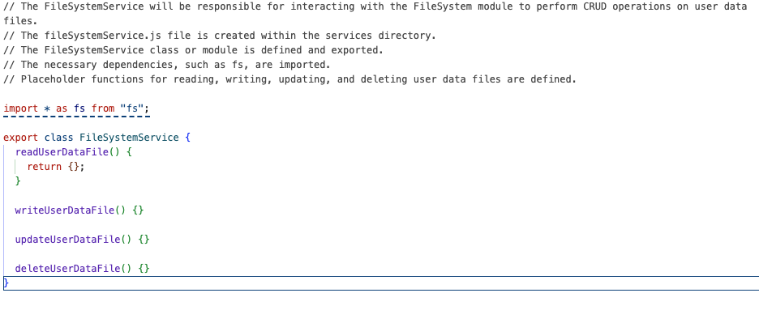

## Ticket #105: Test Express Routes

[#105](https://github.com/orgs/olioapps/projects/11/views/1?pane=issue&itemId=37289264)

## Overview

We are going to use ChatGPT to learn about cURLs to test our API endpoints.

### Resources

[ChatGPT conversation to learn about cURLs](https://chat.openai.com/share/e235ae52-ae55-40a2-a304-031b0ff15d3a/continue)

### Notes

- Query: What are cURLs and how will we use them with express and FileSystem?
  - Response: cURL is a command line tool for transferring data with URL syntax. It is not a core module and must be installed via npm.

### Media

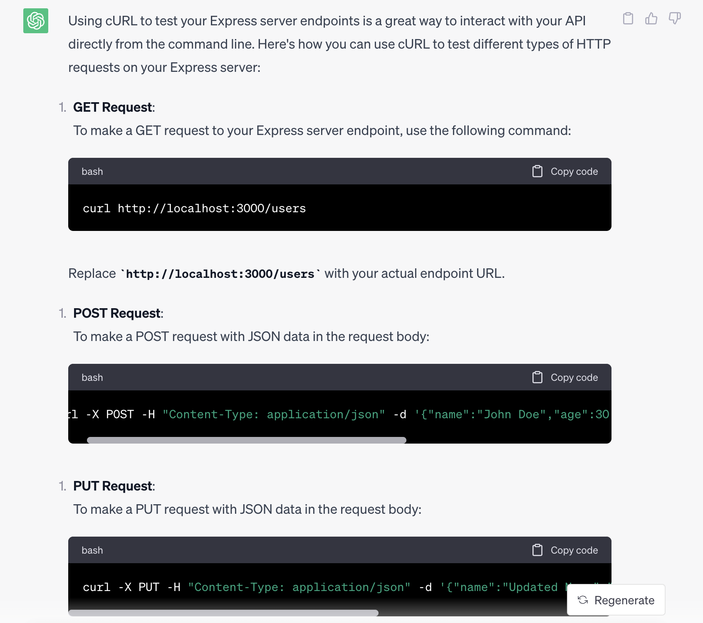
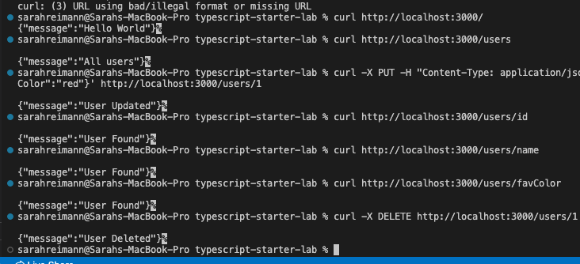
=======

### Notes

- I copy and paste the acceptance criteria that ChatGPT generated into the fileSystemService.ts file as comments
- I accept the suggestions from CoPilot to write the code for the fileSystemService.ts file
- I make small edits based on what I think will work.
- I want to see how much of the code I can write using CoPilot and how much I need to write myself. I will go back and edit this file to make it work with the rest of the application once I have a better sense of what is working and what isn't since this tech/architecture is pretty new to me.

## Integrating FileSystemService with UserAPIService

### Overview

I continued my conversation with ChatGPT to write a new ticket to now link my FileSystemService with my UserAPIService. I decided to keep this integration as one ticket. Then I tried using just coPilot to write the integrated code, realized I needed more context and queried chatGPT.

### Resources

[Conversation on how to integrate filesystem with userAPI](https://chat.openai.com/share/57ed51c8-e426-4e1b-beab-5dc47a35a8be)

### Notes

- The process involved putting in the acceptance criteria as comments and seeing what CoPilot would suggest. Since the integration wasn't working how I expected, I decided to start a new conversation with ChatGPT outside the context of the tech design document. This way I felt I could get example code while getting a better understanding of what I was trying to do.
- Once I worked out what that integration looked like i.e. how I was going to have the constructor take the fileServiceSystem as a parameter and how users were then stored in the UserAPIService, working with coPilot to integrate the code was much easier, as it already had the context of the FSService functions and the userAPIService functions.

## Create UserProvider

### Overview

I used ChatGPT to create a ticket for creating a UserProvider class. I then used CoPilot to write the code for the UserProvider class.

### Resources

[ChatGPT conversation to create UserProvider](https://chat.openai.com/share/12249f85-ce16-455c-9619-4c8f6b561a6c/continue)

### Notes

- We were very unsure of how to implement the architecnture of Controller/Provider/Services so we asked ChatGPT and were able to create a UserProvider file with the information given from ChatGPT and the help of coPilot.

### Media

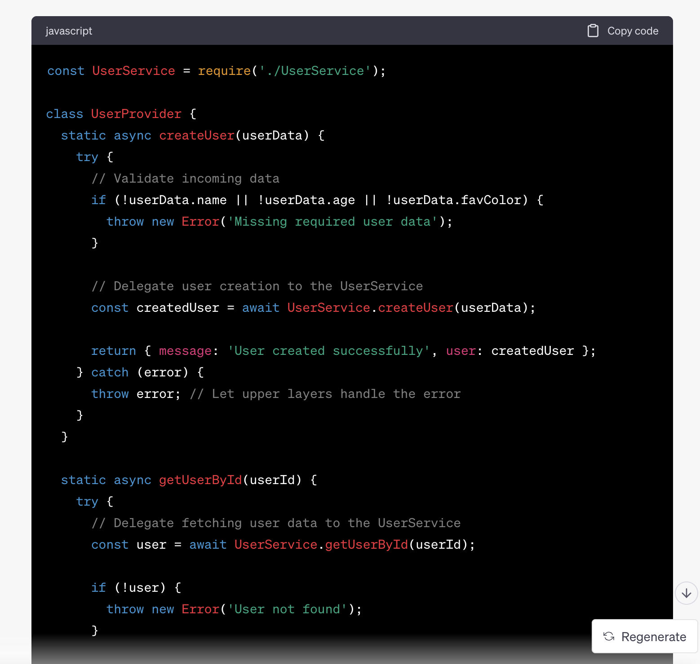

## #112 Connect Express to UserProvider

### Overview

Now that we have a UserProvider class, we need to connect it to our Express app so that the CRUD functions will work.

### Resources

[ChatGPT conversation](https://chat.openai.com/share/4bbfa4dc-ada1-4e0a-b2a7-6bd02c180fc7)
[#112](https://github.com/orgs/olioapps/projects/11/views/1?pane=issue&itemId=37296257)
Used co-pilot

### Media

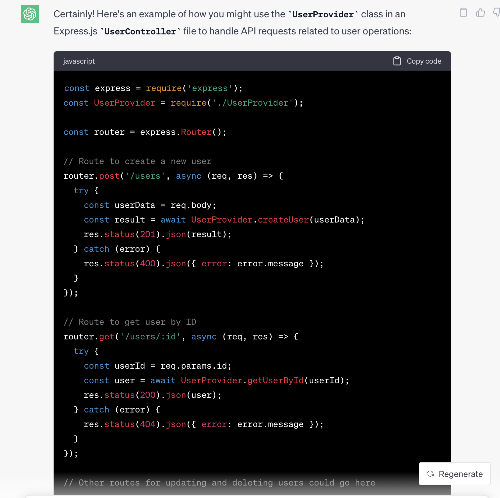

### Notes

-Used copilot to write the code for the UserProvider class
-used copilot to refactor UserController to use providers
-using cURL to test endpoints now that the controller uses the providers but running into an issue of needing to instantiate UserAPI, asking chatGPT for help

## Understanding FileSystemService

### Overview

`fileSystemService.ts` was written by using the ticket acceptance criteria that ChatGPT wrote and plugging them in as comments for Copilot to write the actual code. However, this means that as junior devs we don't necessarily understand what the code is doing since we haven't used File System before. This section is to figure out what the specific code does by querying ChatGPT

### Resources

1. [Out of context ChatGPT convo](https://chat.openai.com/share/ca9e7070-1ea1-40a8-b897-8d4d7a49bf76)
2. [Asking how to implement testing in context](https://chat.openai.com/share/1194e074-9466-4978-9833-d54151c80935)
3. [Further questioning on how to make the test work](https://chat.openai.com/share/f1bfb54b-5f97-466e-8b9e-96aee23213f4)

### Notes

- Two different query strategies: Sarah is asking for more information on the functions within the context of our larger ongoing conversation (the one with the tech doc) and Emma is asking outside of the larger context in a new conversation.
- Sarah's 1st query: please explain in great detail what the function readAllUserDataFiles does
- Sarah's 2nd query: what ultimately gets returned from this function
- Emma's query: please explain in great detail what the function readAllUserDataFiles does
- Emma asked ChatGPT to write tickets for testing the readAllUserDataFiles.
- Sarah is implementing the acceptance criteria from the tickets by copy and pasting them into the test file as comments.
- Copilot wrote tests based on the acceptance criteria. However, this first test is broken because of TypeScript errors.
- We plugged in the error message into chatGPT.
- We were able to understand at least part of what was happening, which was that Copilot implied there was a method inside our filesystemservice that did not exist.
- The test is still failing but we are surprised to see that something is being returned from the function.
- It took over an hour, back and forth between ChatGPT and CoPilot, to get the test to pass, but we ultimately used our own brains to figure out what was going on.
- We were trying to implement a mock implementation of the filesystemservice, but that was very confusing for us, so we queried chatGPT to help us create a setup and tear down that went directly to the data file.
- Copilot surprisingly did not totally understand the context of the User shape, and in retrospect we didn't give a lot of comments beside the acceptance criteria.

### Media

Results of Sarah's 1st Query:
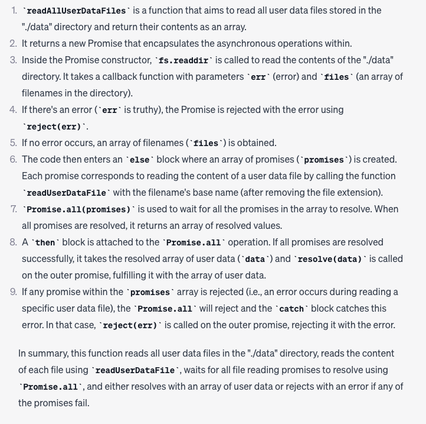

Results of Sarah's 2nd Query:
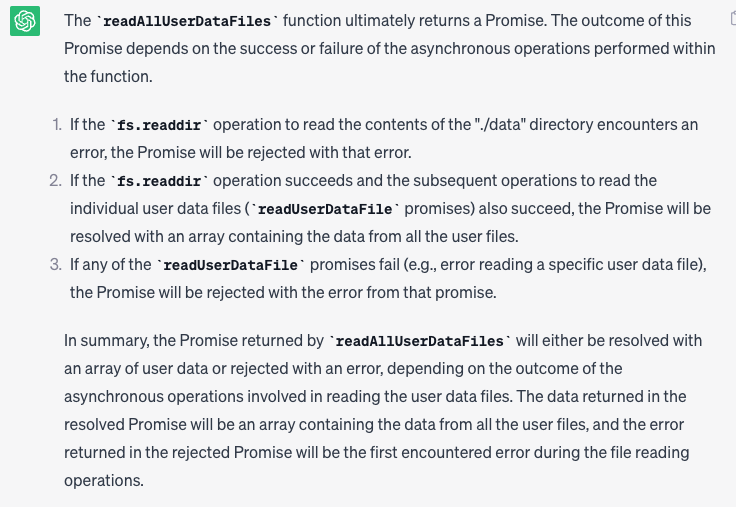

## Writing further tests with ChatGPT

### Overview
After spending all afternoon using co-pilot and chatGPT to write the first test for fileSystemService, it went much smoother to write the rest of the tests. I was able to understand the generated code much better than the first go-around

### Resources
[Conversationg with chatGPT](https://chat.openai.com/share/fc90871e-baeb-42eb-8b42-6a9b25d32cfd)

### Notes
- Once again, generated some tickets with chatGPT and then copy and pasted the acceptance criteria into the test file as comments. 
- Then I had co-pilot generate the rest of the tests

## Testing FileSystemService with AI

### Overview
We moved forward with writing tests for FileSystemService using combination of ChatGPT and Copilot

### Resources
[out of context testing query](https://chat.openai.com/share/e1181cce-54ba-4da2-a0df-4428cd699b32)
[contextual testing query](https://chat.openai.com/share/c783a0a8-8ff3-4c6f-a704-3c0d1da1b05d)

### Notes
- Overall process was to go between ChatGPT and Copilot. ChatGPT would write a ticket, we would copy and paste the acceptance criteria into the test file as comments, and then Copilot would write the test. The tests Copilot wrote did not work, so we queried ChatGPT further, adjusting the code with each iteration.
- Once a working iteration for a test for write user data was written, it was very straight forward for coPilot to write passing tests for the other functions, so the rest of the methods were written and tested very rapidly (in about 10 minutes for all other tests).

## Writing tests for UserAPIService with AI

### Overview
I used the same process from before to write and edit basic passing tests for all methods in the UserAPI service.

### Media
**Query to write tests for UserAPIService**  
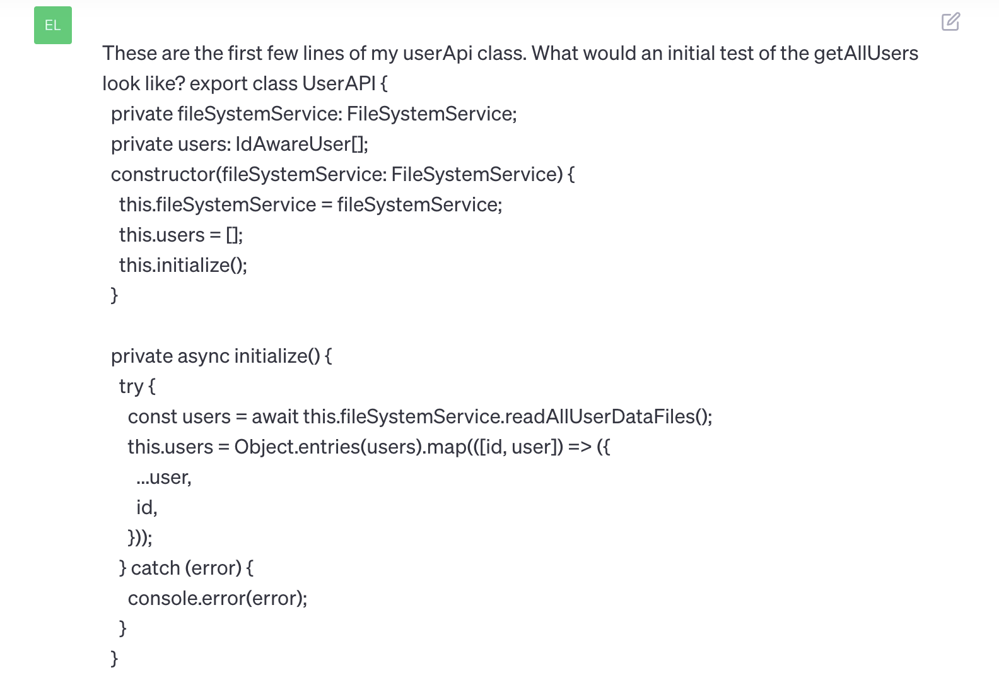

**Response**  
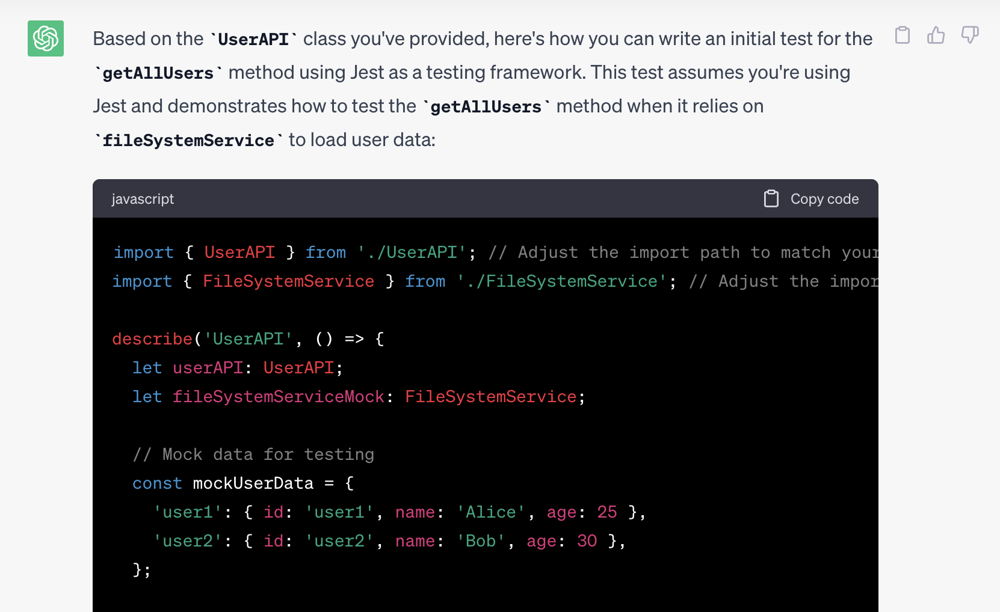
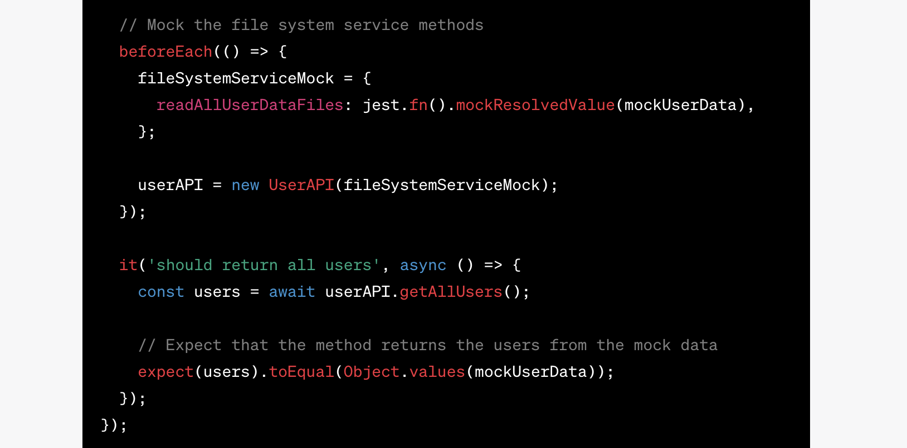
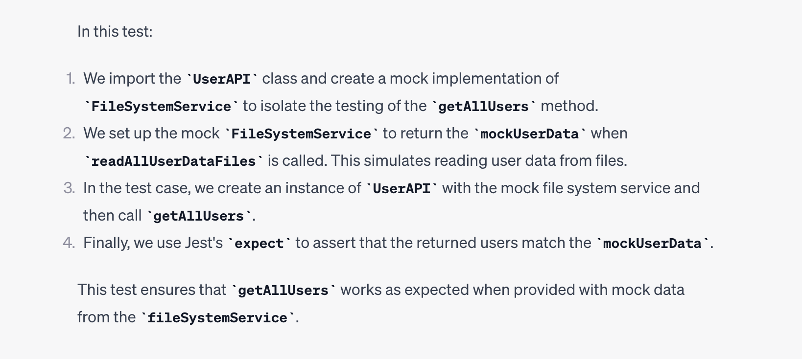

**CoPilot Code**  
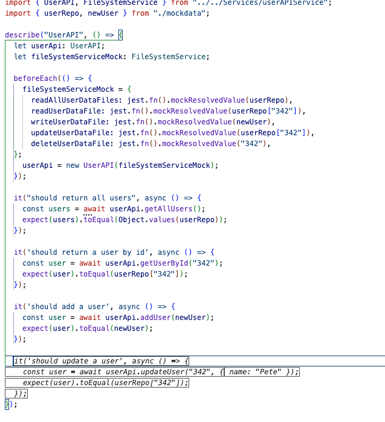

**Edited Copilot Code**  
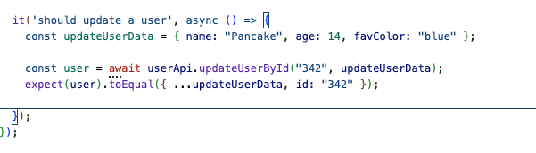

# Overall Thoughts on Using AI

- We noticed that giving chatGPT the high level assignment, it scaffolded an architecture that was a helpful jumping off point but that we ultimately strayed from. We had it write out the initial tickets and then over time realized that many of the tickets were not helpful and we did not use them. As we got further and further into the project, we started writing our own tickets and creating our own direction.
- It it more helpful to use chatGPT for smaller, more pointed questions.
- It was, however, helpful to have a running conversation with chatGPT where it had an understanding of the context of the project and could answer questions based on that context.

